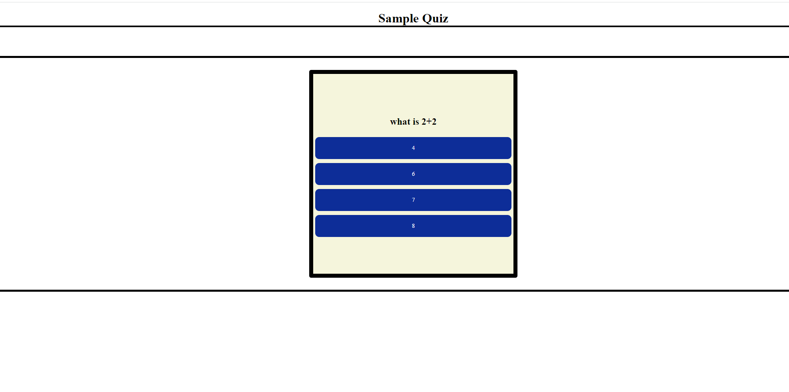

#Quiz App- Bootcamp Module 4 Challenge!

## Demonstrated knowledge of DOM manipulation and using Local Storage to save data in browsers storage

## Quiz Functionality includes
* loops through an array of questions 
* sets a timer with 100 seconds to start
* checks whether answer submitted is correct, if incorrect 15 seconds is removed from timer
*Quiz ends when all questions are answered or timer runs out! Time left on clock is the users score which can be saved in high score!

## Technologies Used
-Javascript
-CSS
-localStorage

## Link to Live application!

## Screenshot Below! 

